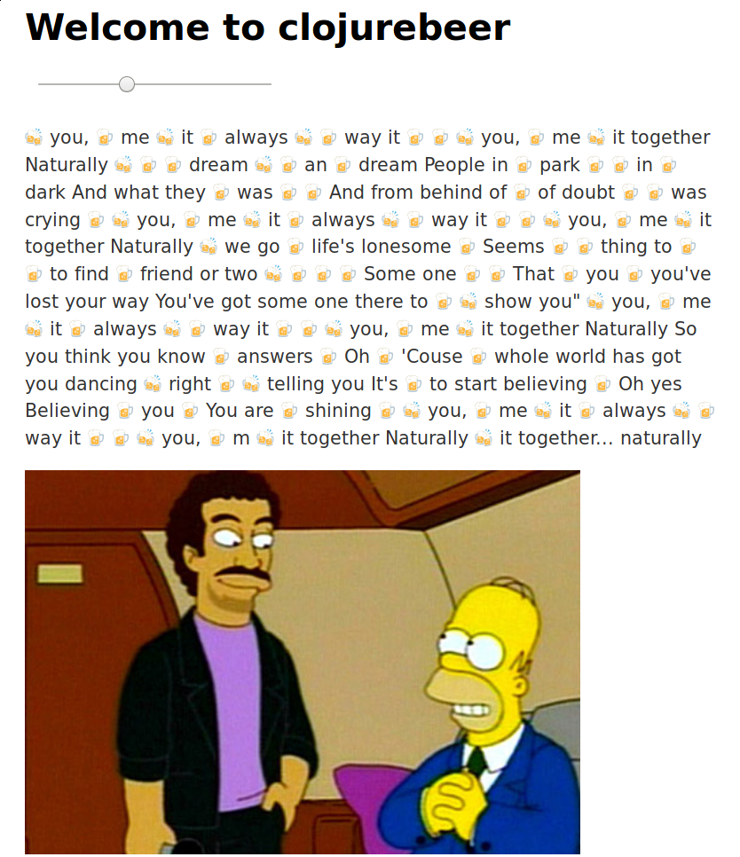

# clojurebeer

Source-Code from Coding Session "Clojure & Beer" held by
[bendisposto](https://github.com/bendisposto) and [n2o](https://github.com/n2o)
at [EntwickelBar 2.0](https://entwickelbar.github.io). First steps with
ClojureScript substituting text into beer emojis depending on the value of a
slider.

Relevant Code located in `src/cljs/clojurebeer/core.cljs`.

Start figwheel with `lein figwheel`.

